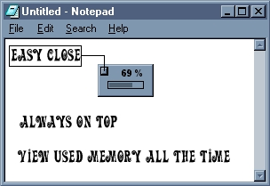



## Mini Memory v1\.0

### Description

This program doesn't do much (displays memory usage percent) but it does include 3 useful modules. The first one allows you to set a window to always on top by suppling an hWnd value. The second allows you to move a borderless window. The third gets the memory status of the computer. Line by line commented. Please rate on code structure, not application functionality. Thnx!
 
### More Info
 

             |
---                |---
**Submitted On**   |2002-12-31 17:14:28
**By**             |[Paul Zaczkowski](https://github.com/Planet-Source-Code/PSCIndex/blob/master/ByAuthor/paul-zaczkowski.md)
**Level**          |Beginner
**User Rating**    |5.0 (10 globes from 2 users)
**Compatibility**  |VB 5\.0, VB 6\.0
**Category**       |[Miscellaneous](https://github.com/Planet-Source-Code/PSCIndex/blob/master/ByCategory/miscellaneous__1-1.md)
**World**          |[Visual Basic](https://github.com/Planet-Source-Code/PSCIndex/blob/master/ByWorld/visual-basic.md)
**Archive File**   |[Mini\_Memor15212112312002\.zip](https://github.com/Planet-Source-Code/paul-zaczkowski-mini-memory-v1-0__1-42043/archive/master.zip)

